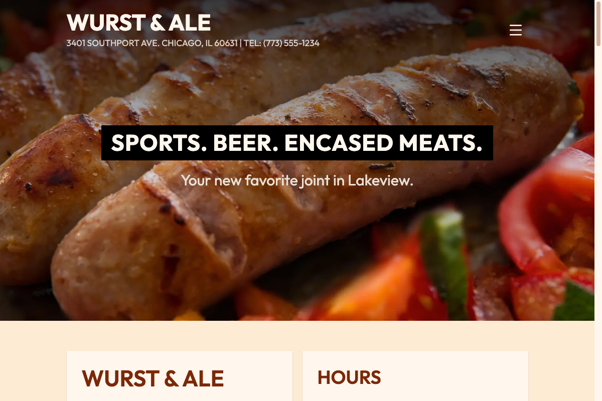

# Wurst & Ale

_Sports. Beer. Encased meats._

**[Live Demo](https://restaurant-demo.narcisolobo.com)**

Wurst & Ale is a fictional Chicago gastropub site built to showcase front-end architecture and design skills — a complete, content-driven small business site with a food menu, beer menu, events calendar, and photo gallery, all built on Astro.

**Note:** Wurst & Ale is not a real business. This project was created solely for portfolio/demonstration purposes and is not affiliated with any actual restaurant, bar, or establishment.

---

## Motivation

This project set out to answer a simple question: what would it take to build a small local business a genuinely useful website, not just a template with their name slapped on it? Food and beer menus with category filtering, a self-updating events calendar, an optimized photo gallery with a custom lightbox, and full responsive image handling throughout — all without a single line of client-side JavaScript unless it was actually earning its place.

---

## Tech Stack

## 🛠️ Tech Stack

- **Frontend:** [Astro](https://astro.build), [TypeScript](https://www.typescriptlang.org)
- **UI:** [Tailwind CSS](https://tailwindcss.com), [DaisyUI](https://daisyui.com), [Tabler Icons](https://tabler.io/icons)
- **Hosting:** [Vercel](https://vercel.com)

---

## Features

- Tabbed food and beer menus with category and subcategory grouping
- Multi-select origin filtering on the beer menu (domestic, craft & local, import)
- Dietary/spice/popularity badges across the food menu
- Self-updating events calendar — always shows the current month plus the next two, with no manual maintenance required
- Custom lightbox photo gallery with aspect-ratio-aware sizing for both landscape and portrait images
- Fully responsive images throughout, using Astro's built-in image optimization
- FAQ accordion, social links, and an interactive map on the Contact page
- SEO metadata configured for professional link previews, with search indexing intentionally disabled since this is a demo site

---

## License

This project is licensed under the [MIT License](./LICENSE).
